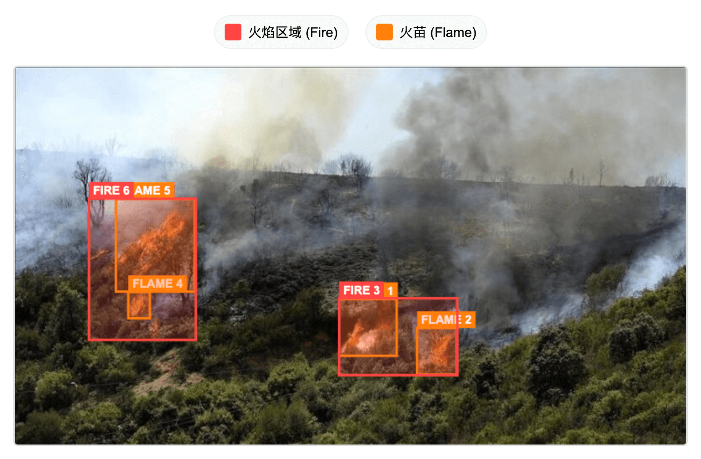
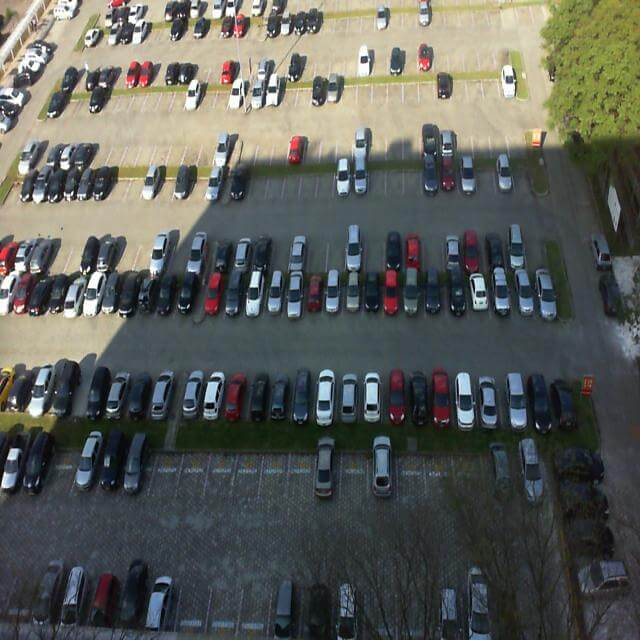
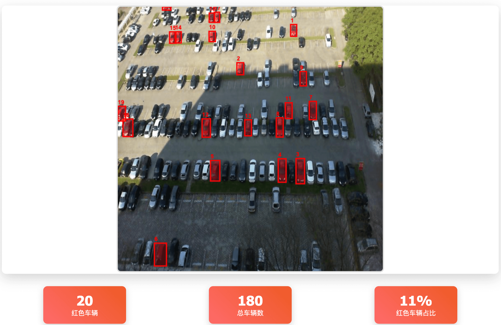
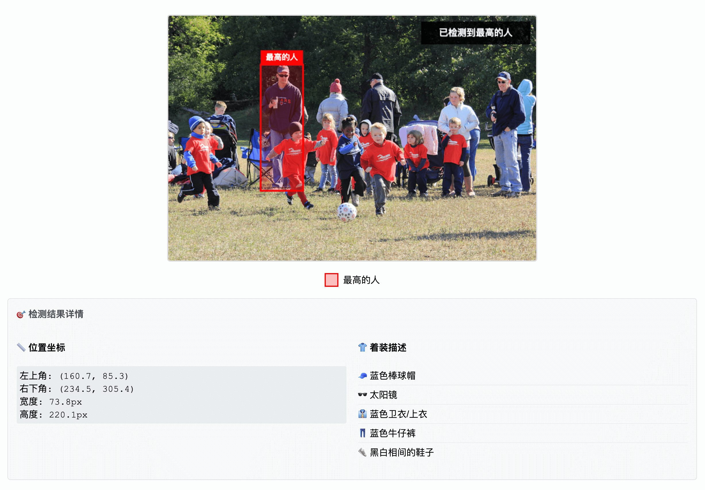
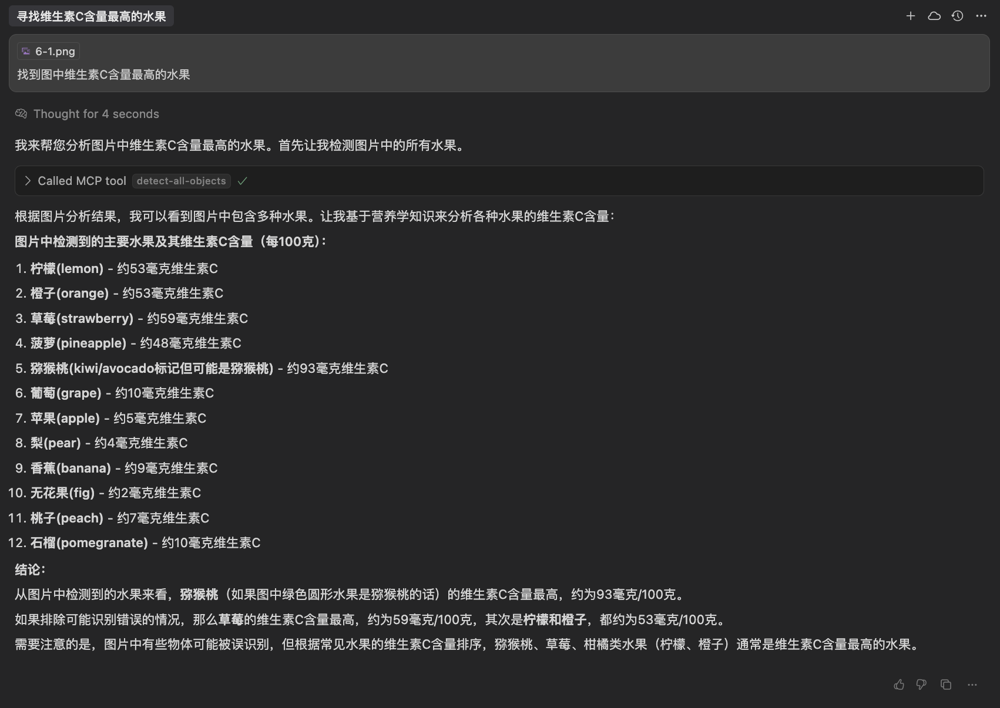

# DINO-X MCP

[](https://opensource.org/licenses/Apache-2.0) [](https://www.npmjs.com/package/@deepdataspace/dinox-mcp) [](https://www.npmjs.com/package/@deepdataspace/dinox-mcp) [](https://github.com/IDEA-Research/DINO-X-MCP/pulls) [](https://github.com/IDEA-Research/DINO-X-MCP/stargazers)

[English](README.md) | **中文**

<p align="center">

DINO-X 官方 MCP 服务器, 基于全球领先的视觉检测模型 DINO-X 和 Grounding DINO 1.6 API，给大模型提供细粒度的目标检测与图像理解能力。

</p>

## 💡 为什么需要 DINO-X MCP？

尽管多模态模型可以理解和描述图像，但它们往往缺乏对视觉内容的精确定位和高质量的结构化输出。

而借助 DINO-X MCP 后, 你可以：

🧠 实现图像的细粒度理解: 支持全图识别、定向检测。

🎯 精准获取目标数量、位置、属性, 并以此为依据进行图像问答等任务。

🧩 支持与其他 MCP Server 组合，构建多步视觉工作流。

🛠️ 构建自然语言驱动的视觉智能体，用于真实场景的自动化任务。

## 🎬 应用案例

| 🎯 场景 | 📝 输入 | ✨ 输出 |
|---------|---------|---------|
| **检测定位** | **💬 提示词：**<br>`帮我框选森林里的`<br>`着火范围并可视化`<br><br>**🖼️ 输入图片：**<br> |  |
| **物体计数** | **💬 提示词：**<br>`请帮我分析这张`<br>`仓库图片，检测其中`<br>`的所有纸箱，统计`<br>`总数量`<br><br>**🖼️ 输入图片：**<br> |  |
| **特征检测** | **💬 提示词：**<br>`找到图中所有红色`<br>`的车，并可视化展示`<br><br>**🖼️ 输入图片：**<br> |  |
| **属性推理** | **💬 提示词：**<br>`找到图中最高的人，`<br>`并描述他的着装，`<br>`用 Canvas 可视化`<br><br>**🖼️ 输入图片：**<br> |  |
| **全图检测** | **💬 提示词：**<br>`找到图中维生素C`<br>`含量最高的水果`<br><br>**🖼️ 输入图片：**<br> | <br><br>*答案：猕猴桃（93mg/100g）* |
| **姿态分析** | **💬 提示词：**<br>`请分析这是什么`<br>`瑜伽姿势，并用`<br>`canvas 显示关键点`<br><br>**🖼️ 输入图片：**<br> |  |


## 🚀 快速开始

### 1. 环境准备

你可以选择以下任一方式安装 Node.js：

#### 方式一：使用命令安装

```bash
# MacOS 或 Linux 系统
# 1. 安装 nvm (Node 版本管理器)
curl -o- https://raw.githubusercontent.com/nvm-sh/nvm/v0.40.1/install.sh | bash
# 或
wget -qO- https://raw.githubusercontent.com/nvm-sh/nvm/v0.40.1/install.sh | bash

# 2. 将以下配置添加到你的终端配置文件中（~/.bash_profile、~/.zshrc、~/.profile 或 ~/.bashrc）
export NVM_DIR="$HOME/.nvm"
[ -s "$NVM_DIR/nvm.sh" ] && \. "$NVM_DIR/nvm.sh"  
[ -s "$NVM_DIR/bash_completion" ] && \. "$NVM_DIR/bash_completion"  

# 3. 在当前终端中激活 nvm
# bash 用户运行：
source ~/.bashrc
# zsh 用户运行：
source ~/.zshrc   

# 4. 验证 nvm 是否安装成功
command -v nvm

# 5. 安装并使用 Node.js LTS 版本
nvm install --lts
nvm use --lts

# Windows 系统
winget install OpenJS.NodeJS.LTS
# 或使用 PowerShell (管理员权限)
iwr -useb https://raw.githubusercontent.com/chocolatey/chocolatey/master/chocolateyInstall/InstallChocolatey.ps1 | iex
choco install nodejs-lts -y
```

#### 方式二：手动下载安装

从 [Node.js 官网](https://nodejs.org/) 下载安装包

同时, 选择一个支持 MCP 协议的 AI 助手或客户端，包括但不限于：

- [Cursor](https://www.cursor.com/)
- [WindSurf](https://windsurf.com/)
- [Trae](https://www.trae.ai/)
- [Cherry Studio](https://www.cherry-ai.com/)

### 2. 配置 MCP 服务器

#### 方式一：使用 NPM 安装包 👍

在你的 MCP 客户端的配置文件中加入配置：

```json
{
  "mcpServers": {
    "dinox-mcp": {
      "command": "npx",
      "args": ["-y", "@deepdataspace/dinox-mcp"],
      "env": {
        "DINOX_API_KEY": "you-api-key-here",
        "IMAGE_STORAGE_DIRECTORY": "/path/to/your/image/directory"
      }
    }
  }
}
```

#### 方式二：使用本地项目

首先，克隆本项目代码到本地并编译

```bash
# 下载源码
git clone https://github.com/IDEA-Research/DINO-X-MCP.git
cd DINO-X-MCP

# 安装依赖
pnpm install

# 编译
pnpm run build
```

然后在 MCP 客户端中配置：

```json
{
  "mcpServers": {
    "dinox-mcp": {
      "command": "node",
      "args": ["/path/to/DINO-X-MCP/build/index.js"],
      "env": {
        "DINOX_API_KEY": "you-api-key-here",
        "IMAGE_STORAGE_DIRECTORY": "/path/to/your/image/directory"
      }
    }
  }
}
```

### 3. 获取API密钥

在 [DINO-X 官网](https://cloud.deepdataspace.com/request_api) 注册账号，新用户有免费 API 额度。

获取 API Key 后，把上面配置中的 `you-api-key-here` 替换成真正的密钥。

### 4. 环境变量配置

DINO-X MCP 服务器支持以下环境变量：

| 变量名 | 描述 | 是否必需 | 默认值 | 示例 |
|--------|------|----------|--------|------|
| `DINOX_API_KEY` | 用于身份验证的 DINO-X API 密钥 | **必需** | - | `your-api-key-here` |
| `IMAGE_STORAGE_DIRECTORY` | 生成的可视化图像的保存目录 | 可选 | **macOS/Linux:** `/tmp/dinox-mcp`<br>**Windows:** `%TEMP%\dinox-mcp` | `/Users/admin/Downloads/dinox-images` |

### 5. 支持的工具

刷新 MCP 配置，就可以在大模型对话中使用以下功能：

| 功能                          | 作用                                                                         | 输入            | 输出                      |
| ----------------------------- | ---------------------------------------------------------------------------- | ------------------- | ------------------------------- |
| `全图万物检测`          | 检测并定位图像中所有可识别的物体                                           | 图片链接                | 每个物体的名称 + 2D框 + 详细描述        |
| `指定目标检测`    | 指定一个或多个目标，检测它们的位置和详细描述                                     | 图片链接 + 目标名字      | 所有指定目标的2D框 + 详细描述              |
| `人体姿态检测` | 检测图像中每个人的17个关键点，用于姿态动作分析                           | 图片链接                | 关键点坐标 + 描述                |
| `检测结果可视化` | 在图像上绘制边界框和标签，可视化检测结果                                    | 图片链接 + 检测结果      | 标注后的图像保存到存储目录              |

## 📝 使用指引

### 支持哪些图片格式？

- 推荐用 `https://` 开头的图片链接
- 或用 `file://` 开头的完整路径
- 常见格式：`jpg、jpeg、png、webp`

### API 使用

可以查看 [DINO-X API 文档](https://cloud.deepdataspace.com/docs)。

## 🛠️ 开发者指引

如果你要修改这个 MCP 服务，可以开启监听模式，代码改动会自动重新编译：

```bash
pnpm run watch
```


遇到问题时，可以用官方调试工具排查：

```bash
pnpm run inspector
```

## 协议

Apache License 2.0